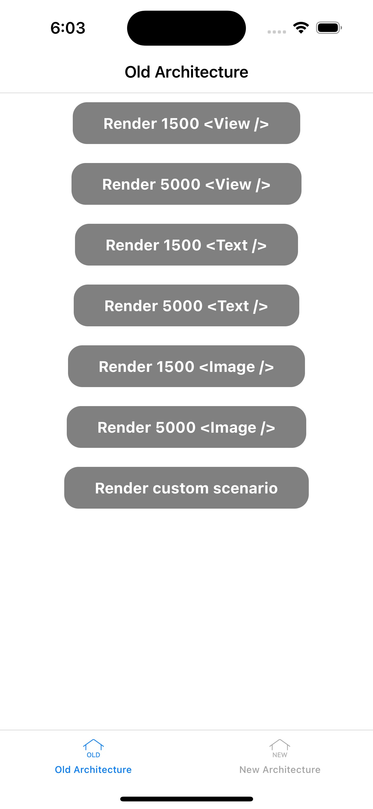
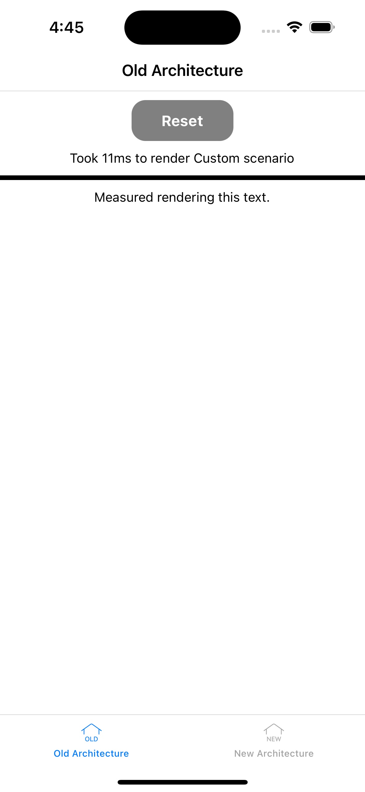

## New Architecture Benchmarks

Thanks to everyone who created benchmarks to compare the old and New Architectures. These benchmarks have helped us to identify [performance gaps](#performance-gaps) in the New Architecture. I want to reassure our users that the React Native team is fully committed to rolling out the New Architecture without introducing any regressions. 

We have prepared an app that consolidates several performance scenarios into a single place. The source code is available in Github repo with instructions how to install it and run the benchmarks. It has a way to switch between old and the New Architecture without the need to rebuild, making it easy to compare the two. It measures the time it takes to render results of an update on screen and display it on screen. Section [How we measured time to render for the benchmarks](#how-we-measured-time-to-render-for-the-benchmarks) covers this more in depth. The results are listed in [Results](#results) section.

However, it is important to note that synthetic benchmarks like the ones used in these comparisons are not always representative of real-world scenarios. Therefore, we do not expect significant performance gains as a result of the migration to the New Architecture. Nonetheless, we believe in [the benefits of the New Architecture](https://reactnative.dev/architecture/fabric-renderer#motivations-and-benefits-of-the-new-renderer) and we are excited to bring it to our users.

## How we measured time to render for the benchmarks

To measure how long an update takes, we need to have timestamps for two events: when the update is initiated and when the result is painted on the screen. 

The update starts when the “Touch ended” event is triggered. “Touch ended” is triggered by the host platform on the UI thread when user lifts their finger off the screen. The event object passed to [`Pressable.onPress`](https://reactnative.dev/docs/pressable#onpress) has this information under the [timestamp](https://reactnative.dev/docs/pressevent#timestamp) key. We pass the timestamp together with a marker name to the native module `RTNTimeToRender` ** to store when the update was initiated. We can’t use the current time in JavaScript because the touch event happened earlier on UI thread.

The update is finished when the results are painted on the screen. React Native does not provide a timestamp for when the results are painted on the screen out of the box. We will have to write a small native component that will do it for us. The native component has “marker name” as its prop. Using host platform APIs, we can precisely capture when the component was painted. Now we subtract the timestamp of when the update was initiated, stored in `RTNTimeToRender`*,* and we know how long it took to paint the result.

## Results

Each value presented here is an average of five measurements. The measurements were collected on physical devices running React Native 0.72.0-RC.1. It's important to note that these are synthetic benchmarks and may not reflect real-world usage of React Native. It's possible that migrating to the New Architecture may not result in performance improvements for your specific app. 

### Physical Device: Google Pixel 4

|Scenario	|Old Architecture	|New Architecture	|Difference	|
|---	|---	|---	|---	|
|1500 <View />	|282ms	|258ms	|New Architecture is ~8% faster	|
|5000 <View />	|1088ms	|1045ms	|New Architecture is ~4% faster	|
|1500 <Text />	|512ms	|505ms	|New Architecture is ~1% faster	|
|5000 <Text />	|2156ms	|2089ms	|New Architecture is ~3% faster	|
|1500 <Image />	|406ms	|404ms	|New Architecture is neutral with Old Architecture	|
|5000 <Image />	|1414ms	|1370ms	|New Architecture is ~3% faster	|

### Physical Device: iPhone 12 Pro

|Scenario	|Old Architecture	|New Architecture	|Difference	|
|---	|---	|---	|---	|
|1500 <View />	|137ms	|117ms	|New Architecture is ~15% faster	|
|5000 <View />	|435ms	|266ms	|New Architecture is ~39% faster	|
|1500 <Text />	|324ms	|284ms	|New Architecture is ~13% faster	|
|5000 <Text />	|1009ms	|808ms	|New Architecture is ~20% faster	|
|1500 <Image />	|212ms	|172ms	|New Architecture is ~19% faster	|
|5000 <Image />	|673ms	|451ms	|New Architecture is ~33% faster	|

## Write your own performance scenario

If you're interested in comparing the performance of your own components between the old and New Architectures, go to [App.tsx](./App/App.tsx#L55), add your code and follow the instructions in [How to run the app](#how-to-run-the-app). When you run the app, it will display the time it took to render your components. You can switch between the old and New Architectures using the buttons at the bottom. Happy testing!

  
   

## How to run the app
To build and run the benchmarks, please install the necessary dependencies. Please follow the instructions on [reactnative.dev](https://reactnative.dev/docs/next/environment-setup)

Instructions for iOS

1. `git clone --branch new-architecture-benchmarks https://github.com/react-native-community/RNNewArchitectureApp`
2. `cd RNNewArchitectureApp/App` 
3. `yarn install`
4. `cd ios`
5. `bundle install && RCT_NEW_ARCH_ENABLED=1 bundle exec pod install` 
6. `cd ..`
7. `yarn ios --configuration Release` to build the app with optimisations.
8. `yarn ios` to build the app in debug mode.

Instructions for Android

1. `git clone --branch new-architecture-benchmarks https://github.com/react-native-community/RNNewArchitectureApp`
2. `cd RNNewArchitectureApp/App` 
3. `yarn install`
4. `yarn android --mode release` to build the app with optimisations.
5. `yarn android` to build the app in debug mode.

## Performance gaps

We discovered three performance problems in the New Architecture. One affecting both Android and iOS. One that is specific to Android and and one that is specific to iOS. These issues have been fixed in the 0.72.0-RC.1 release candidate.

The biggest deficit was caused by the missing `NDEBUG` compiler flag in optimized builds. The `NDEBUG` compiler flag is used to disable debugging features in C++ programs. Core of the New Architecture is written in C++, and without the `NDEBUG` flag in optimized builds, the code performs debug only checks. The fix for this issue ([Android](https://github.com/facebook/react-native/commit/8486e191a170d9eae4d1d628a7539dc9e3d13ea4), [iOS](https://github.com/facebook/react-native/commit/421df9ffd58092b1a2dec455a048edb6db1739de)) is available in the 0.72.0-RC.1. These checks are for debugging only and must be removed in optimized builds for optimal performance.

Additionally, we discovered redundant work in our text rendering infrastructure on both platforms. 
On iOS, we were creating `NSTextStorage` twice for every `<Text />` element: once to measure the size of the text for Yoga to layout other parts of the UI, and a second time to paint the text on the screen. `NSTextStorage` is expensive to create and can be cached. This issue has been [fixed](https://github.com/facebook/react-native/commit/d41e95fb1a75514a10434b9dc39ba14979faf8bd) and now rendering of 5,000 `<Text />` elements is 20% faster in the New Architecture. This is available in the 0.72.RC.1.

On Android, we found that React Native was re-measuring the same text multiple times with the same constraints. Measuring text in Android is expensive because it requires transferring text data from C++ to Java through JNI, creating `Spannable` objects, and finally calculating the layout. This logic has been optimized in this [commit](https://github.com/facebook/react-native/commit/8c01b56f1209285e3687d6c259bc05a478225985). Additionally, we added a second layer of caching in Android to avoid recreating `Spannable` `Text` objects during rendering.